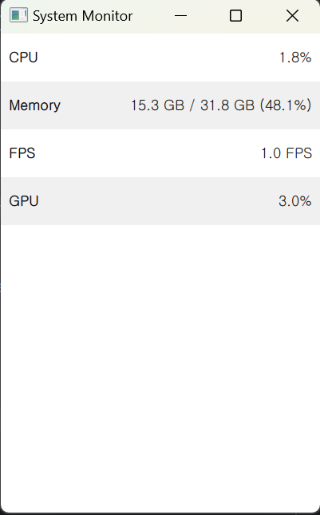

# Resouce Monitor pyQT
- 한양사이버 대학교 미니프로젝트 기말과제

## 개발목적
- 현재 PC 의 자원을 실시간으로(1초 주기) 모니터링 할수있는 GUI프로그램
  
## 유사 프로그램
- 윈도우 작업관리자

## 개발 기간
- 11월 24일 ~11월 30일

## 개발환경
- miniconda
- Pycharm IDE

## Requirement
- GPUtil==1.4.0
- psutil==6.1.0
- PyQt5==5.15.11
- PyQt5-Qt5==5.15.2
- PyQt5_sip==12.15.0
## 패키지 설치
```python
pip install -r requirements.txt
```
## MVVM 패턴 적용

- https://ko.wikipedia.org/wiki/%EB%AA%A8%EB%8D%B8-%EB%B7%B0-%EB%B7%B0%EB%AA%A8%EB%8D%B8

## 프로그램 흐름
객체의 통신은 QT의 시그널 슬롯 알고리즘을 사용하여 구현되었고  
controller 객체가 PC의 리소스 정보를 취득하여  
model객체로 정보를 전달하고 model은 view-model로 정보를 전달후  
최종적으로 UI가 정보를 수신하여 디스플레이한다  
## 실행이미지


## 참고 문헌
### QT QML 모델 뷰 프로그래밍
- https://doc.qt.io/qt-6/qtquick-modelviewsdata-modelview.html
### MVVM 패턴
- https://ko.wikipedia.org/wiki/%EB%AA%A8%EB%8D%B8-%EB%B7%B0-%EB%B7%B0%EB%AA%A8%EB%8D%B8

## 활용가치 및 향후계획
- MVVM 패턴 적용하여 UI와 로직의 결합도를 최소화해   
  유지보수가 용이한 프로그래밍 작성
- 각 클래스의 역할을 명확하게 구분하여 객체지향적으로 설계하였음
- 현재는 기능이 많지 않지만  
QML 의 모델 뷰 패턴을 적용하여 UI 기능의 추가 제거가 용이하도록 설계하였음
``` qml
ListModel {
        id: monitorModel
        ListElement {
            name: "CPU"
            value: "0%"
        }
        ListElement {
            name: "Memory"
            value: "0 GB / 0 GB"
        }
        ListElement {
            name: "FPS"
            value: "0"
        }
        ListElement {
            name: "GPU"
            value: "0%"
        }
    }
ListView {
            Layout.fillWidth: true
            Layout.fillHeight: true
            model: monitorModel
            delegate: monitorDelegate
        }
```