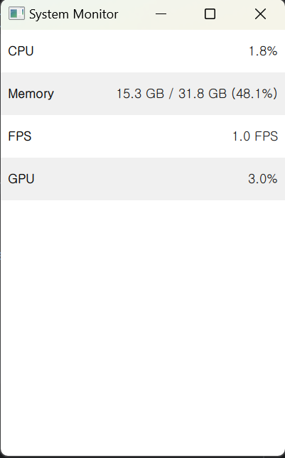
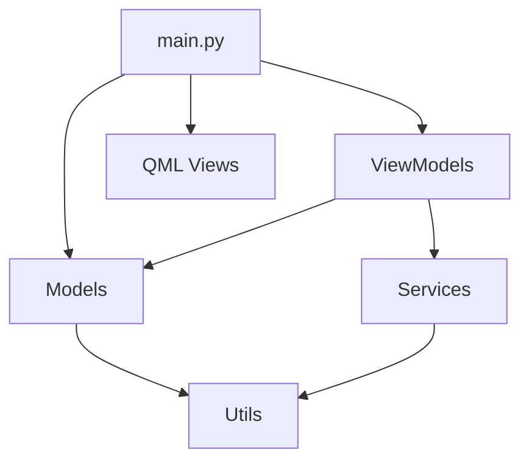

# Resource Monitor PyQt

Python과 PyQt5/QML 기반의 실시간 시스템 자원 모니터링 데스크톱 애플리케이션입니다.

## 주요 기능

| 탭 | 기능 | 설명 |
|---|---|---|
| 시스템 개요 | CPU, 메모리, GPU, FPS | 실시간 게이지 및 히스토리 그래프 |
| 프로세스 | 프로세스 관리 | 검색, 정렬, 트리 모드, 프로세스 제어 (Kill, 우선순위 변경) |
| 디스크 | 파티션 모니터링 | 사용량 바, I/O 통계 |
| 네트워크 | 인터페이스 모니터링 | 트래픽 속도, IP/MAC 정보, Ping 테스트 |
| 하드웨어 | GPIO, USB, Serial | 하드웨어 인터페이스 정보 (선택적) |

## 스크린샷



## 아키텍처

MVVM(Model-View-ViewModel) 패턴을 적용하여 UI와 비즈니스 로직을 분리합니다.


```mermaid
graph TD
    A["main.py"] --> B["Models"]
    A --> C["ViewModels"]
    A --> D["QML Views"]

    C --> B
    C --> E["Services"]
    B --> F["Utils"]
    E --> F
```

| 레이어 | 디렉터리 | 역할 |
|--------|---------|------|
| Model | `models/` | 데이터 상태 관리 및 변경 시그널 발출 |
| ViewModel | `views/` | 데이터 포맷팅, 타이머/워커 관리 |
| View | `qml/` | QML 기반 UI 렌더링 |
| Service | `services/` | 백그라운드 워커 스레드 |
| Utility | `utils/` | 시스템 데이터 수집 모듈 |

> 상세 아키텍처 문서: [docs/architecture.md](docs/architecture.md)

## 프로젝트 구조

```
Resource-Monitor-pyQT/
├── main.py                     # 엔트리 포인트
├── monitor_base.py             # ResourceMonitor 추상 기반 클래스
├── models/                     # 데이터 모델 (QObject, QAbstractListModel)
│   ├── monitor_model.py        # CPU/메모리/GPU/FPS 통합
│   ├── process_model.py        # 프로세스 리스트
│   ├── process_sort_filter_model.py  # 정렬/필터 프록시
│   ├── disk_model.py           # 디스크 파티션
│   ├── network_model.py        # 네트워크 인터페이스
│   └── hardware_model.py       # GPIO/USB/Serial
├── views/                      # ViewModel (프레젠테이션 로직)
│   ├── monitor_viewmodel.py
│   ├── process_viewmodel.py
│   ├── disk_viewmodel.py
│   ├── network_viewmodel.py
│   └── hardware_viewmodel.py
├── services/                   # 백그라운드 워커
│   ├── worker_thread.py        # 프로세스 수집 워커
│   └── ping_worker.py          # Ping 워커
├── utils/                      # 시스템 데이터 수집
│   ├── cpu_monitor.py, memory_monitor.py, gpu_monitor.py, fps_monitor.py
│   ├── disk_monitor.py, network_monitor.py, net_info_monitor.py
│   ├── process_monitor.py, process_tree.py, ping_util.py
│   ├── gpio_monitor.py, usb_monitor.py, serial_monitor.py
│   └── settings_manager.py
├── qml/                        # Qt Quick UI
│   ├── main.qml                # 메인 윈도우 (5개 탭)
│   ├── tabs/                   # 탭 컴포넌트
│   └── components/             # 재사용 UI 컴포넌트
└── docs/
    └── architecture.md         # 아키텍처 문서 (Mermaid 다이어그램)
```

## 설치 및 실행

### 요구사항

- Python 3.7 이상
- pip 또는 Miniconda/Anaconda

### 의존성 설치

```bash
pip install -r requirements.txt
```

### 실행

```bash
python main.py
```

## 기술 스택

| 분류 | 기술 | 버전 |
|------|------|------|
| 언어 | Python | 3.7+ |
| GUI | PyQt5 | 5.15.11 |
| UI | QML (Qt Quick) | 2.15 |
| 시스템 모니터링 | psutil | 6.1.0 |
| GPU (선택) | GPUtil | 1.4.0 |

### 선택적 의존성

GPU, GPIO, USB, Serial 모니터링은 해당 라이브러리가 없어도 애플리케이션이 정상 작동합니다.

```bash
pip install GPUtil     # GPU 모니터링
pip install RPi.GPIO   # GPIO (라즈베리파이)
pip install pyusb      # USB 장치 정보
pip install pyserial   # 직렬 통신
```

## 디자인 패턴

- **MVVM**: Model-View-ViewModel 계층 분리
- **Template Method**: `ResourceMonitor` 추상 클래스 상속
- **Observer**: PyQt Signal/Slot 메커니즘
- **Proxy**: `ProcessSortFilterProxyModel`
- **Dependency Injection**: ViewModel 생성자 주입
- **Graceful Degradation**: 선택적 의존성 자동 비활성화

## 참고 문헌

- [Qt QML Model-View Programming](https://doc.qt.io/qt-6/qtquick-modelviewsdata-modelview.html)
- [MVVM 패턴](https://ko.wikipedia.org/wiki/%EB%AA%A8%EB%8D%B8-%EB%B7%B0-%EB%B7%B0%EB%AA%A8%EB%8D%B8)
