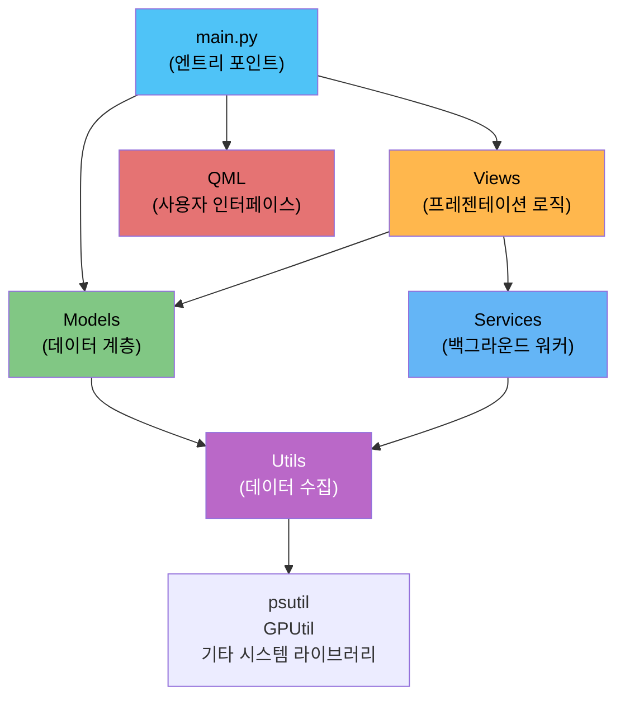
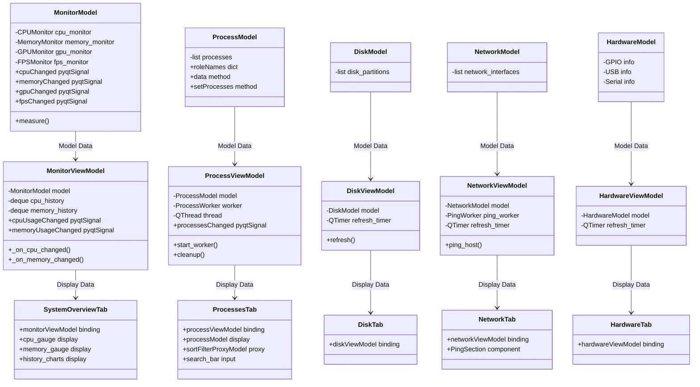
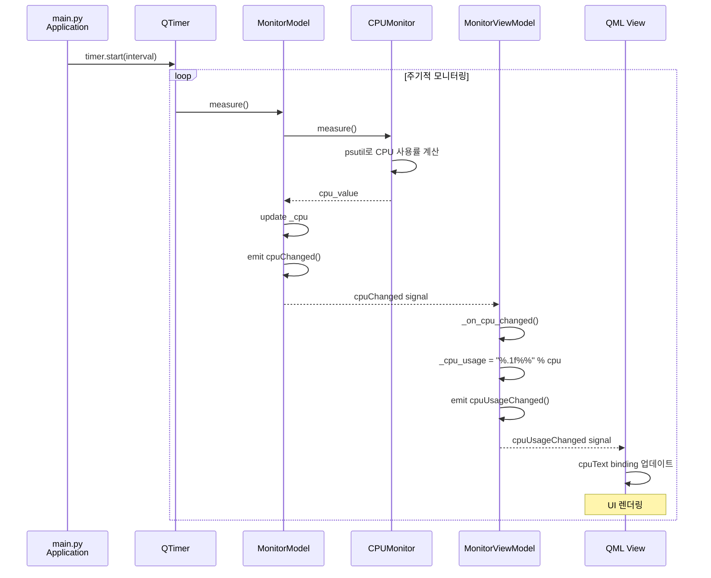
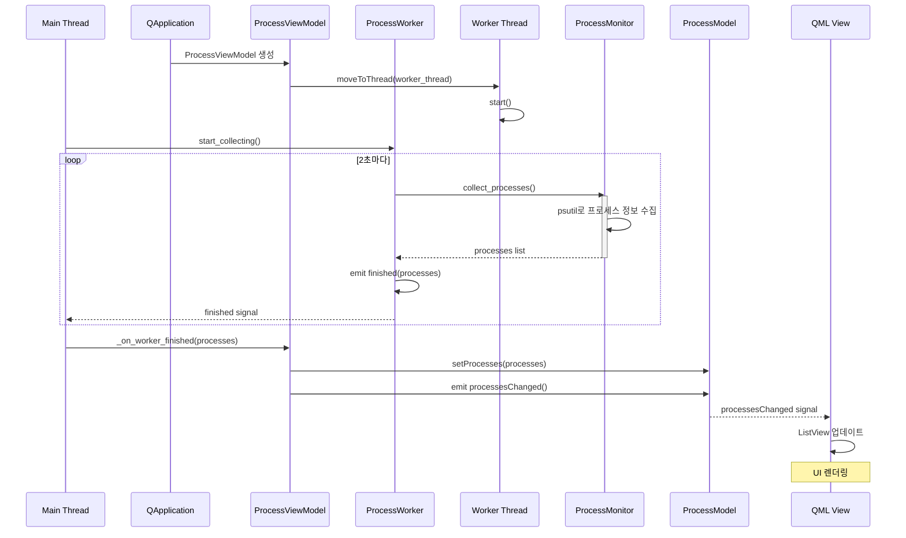
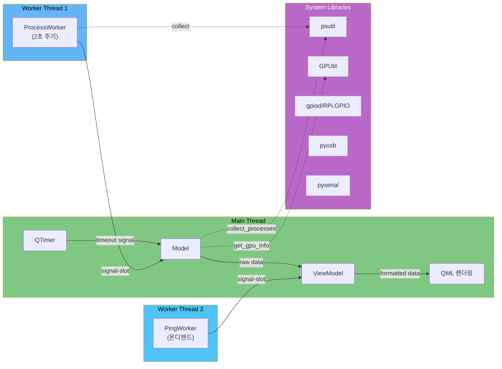
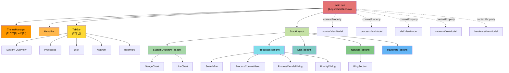
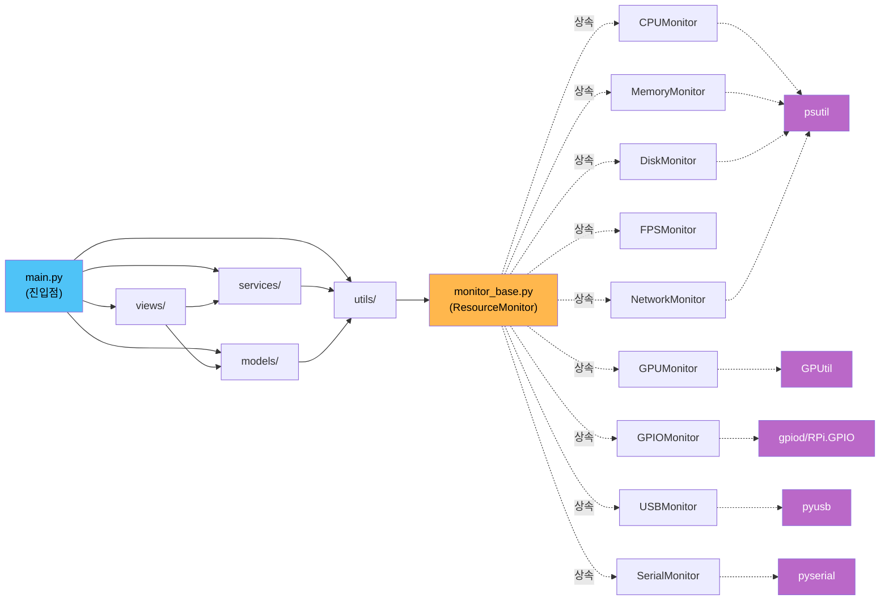
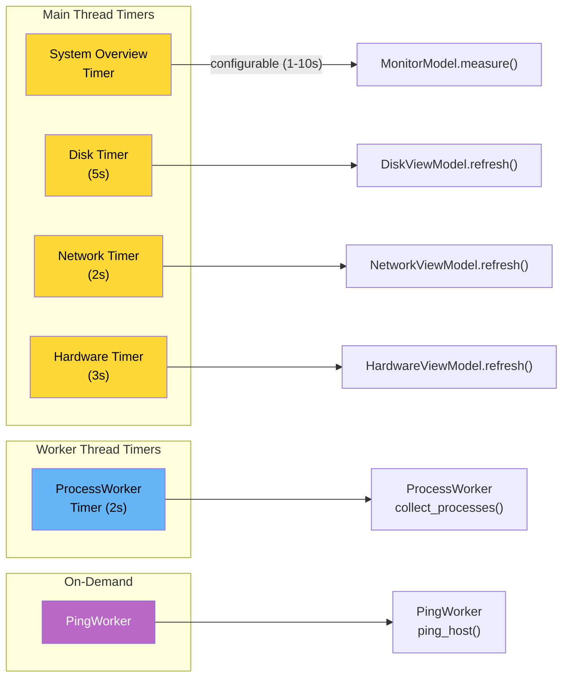

# Resource Monitor PyQt - 아키텍처 문서

## 목차

1. [개요](#개요)
2. [시스템 아키텍처](#시스템-아키텍처)
3. [MVVM 패턴](#mvvm-패턴)
4. [데이터 흐름](#데이터-흐름)
5. [스레딩 모델](#스레딩-모델)
6. [QML 컴포넌트 구조](#qml-컴포넌트-구조)
7. [모듈 의존성](#모듈-의존성)
8. [디자인 패턴](#디자인-패턴)
9. [타이머 조정](#타이머-조정)
10. [기술 스택](#기술-스택)

---

## 개요

Resource Monitor PyQt는 Python 3.7+, PyQt5, 그리고 QML을 기반으로 한 시스템 리소스 모니터링 애플리케이션입니다. 이 프로젝트는 CPU, 메모리, GPU, FPS, 디스크, 네트워크, GPIO, USB, 직렬 통신 등 다양한 시스템 리소스를 실시간으로 모니터링합니다.

### 주요 특징

- **다중 리소스 모니터링**: CPU, 메모리, GPU, FPS, 디스크, 네트워크, 하드웨어 정보 제공
- **우아한 성능 저하**: 선택적 의존성(GPU, GPIO, USB, Serial)을 지원하며 누락 시에도 정상 작동
- **MVVM 아키텍처**: PyQt Model-ViewModel 패턴으로 깔끔한 계층 분리
- **멀티스레드 처리**: 메인 스레드 블로킹 방지를 위해 백그라운드 워커 스레드 사용
- **QML UI**: 최신 Qt Quick 프레임워크로 반응형 사용자 인터페이스 제공
- **설정 관리**: QSettings 기반 다크/라이트 테마, 윈도우 크기, 업데이트 간격 저장

---

## 시스템 아키텍처



### 계층 설명

**Entry Point (main.py)**
- 애플리케이션 부트스트랩: QGuiApplication 생성 및 QML 엔진 초기화
- 모든 Model과 ViewModel 인스턴스 생성
- 저장된 설정(테마, 윈도우 크기, 업데이트 간격) 로드
- 모니터링 타이머 및 워커 스레드 초기화
- 애플리케이션 종료 시 안전한 리소스 정리

**Models (데이터 계층)**
- QObject/QAbstractListModel 기반으로 PyQt 신호-슬롯 메커니즘 활용
- 실시간 리소스 데이터 관리 및 상태 변경 시그널 발출
- MonitorModel: CPU, 메모리, GPU, FPS 통합 데이터 제공
- ProcessModel: 프로세스 리스트 데이터 제공
- DiskModel, NetworkModel, HardwareModel: 각각 디스크, 네트워크, 하드웨어 데이터 제공

**Views (프레젠테이션 로직)**
- Model의 원시 데이터를 표시용 문자열과 그래프 데이터로 변환
- ViewModel은 신호-슬롯 연결로 Model 변경 감지 및 QML 프로퍼티 업데이트
- ProcessViewModel: 프로세스 컨트롤 및 워커 스레드 관리
- 각 탭별 ViewModel이 해당 데이터 관리 (DiskViewModel, NetworkViewModel, HardwareViewModel)

**QML (사용자 인터페이스)**
- ApplicationWindow를 기반으로 TabBar와 StackLayout으로 5개 탭 구성
- 각 탭(SystemOverviewTab, ProcessesTab, DiskTab, NetworkTab, HardwareTab)이 담당 ViewModel과 연결
- 컴포넌트: SearchBar, ProcessContextMenu, PriorityDialog, SettingsDialog, PingSection 등

**Services (백그라운드 워커)**
- ProcessWorker: QThread 기반 2초 주기 프로세스 수집
- PingWorker: 비동기 Ping 작업 처리

**Utils (데이터 수집)**
- 각 모니터 클래스가 ResourceMonitor 추상 클래스 상속
- CPUMonitor, MemoryMonitor, GPUMonitor, FPSMonitor: 주기적 측정
- DiskMonitor, NetworkMonitor, ProcessMonitor, GPIOMonitor, USBMonitor, SerialMonitor: 시스템 정보 수집
- 선택적 의존성 처리로 라이브러리 미설치 시 우아하게 무시

---

## MVVM 패턴

Resource Monitor는 PyQt의 강력한 신호-슬롯 메커니즘을 활용한 MVVM 아키텍처를 구현합니다.



### MVVM 흐름

1. **Model**: 시스템으로부터 실시간 데이터 수집 및 내부 상태 유지
2. **View Model**: Model의 시그널 감지 → 데이터 포맷팅 → pyqtProperty로 QML에 노출
3. **View (QML)**: ViewModel의 바인딩된 프로퍼티 감시 → UI 자동 업데이트

### 신호-슬롯 메커니즘

- **Model → ViewModel**: `model.cpuChanged.connect(viewmodel._on_cpu_changed)`
- **ViewModel → QML**: `@pyqtProperty`로 선언된 프로퍼티가 자동으로 바인딩
- **QML → ViewModel**: `onClicked`, `onTextChanged` 등 QML 신호가 ViewModel 슬롯 호출

---

## 데이터 흐름



### 프로세스 수집 흐름



---

## 스레딩 모델



### 스레딩 안전성

**Main Thread 책임**:
- QML 렌더링
- Timer 관리
- Model/ViewModel 상태 관리
- Signal-Slot 신호 처리

**Worker Thread 책임**:
- CPU 집약적 작업 처리 (프로세스 수집, Ping)
- 메인 스레드 블로킹 방지
- `finished` 시그널로 결과 반환

**Signal-Slot 안전성**:
- Qt의 신호-슬롯 메커니즘은 자동으로 스레드 간 안전성 보장
- Worker 스레드에서 Main 스레드 객체의 슬롯 호출 시 메시지 큐를 통해 직렬화

---

## QML 컴포넌트 구조



### 탭 설명

| 탭 이름 | 파일 | 설명 | ViewModel |
|---------|------|------|-----------|
| System Overview | SystemOverviewTab.qml | CPU/메모리/GPU/FPS 게이지 및 히스토리 그래프 | MonitorViewModel |
| Processes | ProcessesTab.qml | 프로세스 목록, 검색, 정렬, 트리 모드 | ProcessViewModel |
| Disk | DiskTab.qml | 디스크 파티션 및 사용률 바 | DiskViewModel |
| Network | NetworkTab.qml | 네트워크 인터페이스 및 Ping 테스트 | NetworkViewModel |
| Hardware | HardwareTab.qml | GPIO, USB, 직렬 통신 정보 | HardwareViewModel |

---

## 모듈 의존성



### 모듈 역할

**models/** - 데이터 저장소
- `monitor_model.py`: CPU, 메모리, GPU, FPS 통합 모니터 (QObject)
- `process_model.py`: 프로세스 목록 (QAbstractListModel)
- `process_sort_filter_model.py`: 프로세스 정렬/필터링 (QSortFilterProxyModel)
- `disk_model.py`: 디스크 파티션 (QAbstractListModel)
- `network_model.py`: 네트워크 인터페이스 (QAbstractListModel)
- `hardware_model.py`: GPIO/USB/직렬 정보 (QObject)

**views/** - 프레젠테이션 로직
- `monitor_viewmodel.py`: CPU/메모리/GPU/FPS 포맷팅 및 히스토리 관리
- `process_viewmodel.py`: 프로세스 제어 및 워커 스레드 관리
- `disk_viewmodel.py`: 디스크 새로고침 타이머 관리
- `network_viewmodel.py`: 네트워크 새로고침 및 Ping 워커
- `hardware_viewmodel.py`: 하드웨어 새로고침 타이머 관리

**services/** - 백그라운드 워커
- `worker_thread.py`: ProcessWorker (QThread, 2초 주기)
- `ping_worker.py`: PingWorker (비동기 Ping)

**utils/** - 데이터 수집
- 각 모니터 클래스: `monitor_base.py` 상속
- 유틸리티: `process_tree.py`, `ping_util.py`, `settings_manager.py`

---

## 디자인 패턴

### 1. Template Method Pattern (템플릿 메서드)

```python
# monitor_base.py의 ResourceMonitor 추상 클래스
class ResourceMonitor(ABC):
    def __init__(self):
        self.last_measurement = 0
        self.current_measurement = 0

    @abstractmethod
    def measure(self):
        """서브클래스가 구현할 추상 메서드"""
        pass

    def get_measurement(self):
        """모든 모니터가 공유하는 인터페이스"""
        return self.current_measurement
```

**사용처**: CPUMonitor, MemoryMonitor, GPUMonitor, FPSMonitor 등이 ResourceMonitor를 상속하여 measure() 구현

### 2. MVVM Pattern (Model-View-ViewModel)

**Model**: 실시간 데이터 소유 및 신호 발출
**ViewModel**: Model 감시 → 데이터 포맷팅 → pyqtProperty로 노출
**View (QML)**: ViewModel 바인딩 → 자동 UI 업데이트

### 3. Observer Pattern (옵저버)

PyQt의 Signal-Slot 메커니즘으로 구현
- Model의 신호가 변경되면 ViewModel이 슬롯으로 감지
- ViewModel의 신호가 발출되면 QML이 바인딩으로 감지

### 4. Proxy Pattern (프록시)

ProcessSortFilterProxyModel이 ProcessModel의 프록시로 동작
- 정렬 및 필터링 기능 제공
- 원본 Model 수정 없이 표시 방식 변경

### 5. Dependency Injection (의존성 주입)

```python
# main.py
model = MonitorModel()
view_model = MonitorViewModel(model)  # Model을 ViewModel에 주입

# ViewModel은 받은 model 사용
class MonitorViewModel(QObject):
    def __init__(self, model, parent=None):
        self._model = model
        self._model.cpuChanged.connect(self._on_cpu_changed)
```

### 6. Graceful Degradation (우아한 성능 저하)

```python
# monitor_model.py
try:
    self._monitors['gpu'] = GPUMonitor()
except ImportError:
    print(f"GPU 모니터링을 사용할 수 없습니다.")
```

**특징**: 선택적 의존성 누락 시에도 애플리케이션 정상 작동

### 7. Worker Thread Pattern (워커 스레드)

ProcessWorker와 PingWorker는 QThread 기반으로 CPU 집약적 작업을 백그라운드에서 처리
- `moveToThread()` 패턴 사용
- `finished` 신호로 결과 반환
- 메인 스레드 블로킹 방지

---

## 타이머 조정



| 컴포넌트 | 주기 | 스레드 | 설정 가능 |
|---------|------|--------|----------|
| System Overview | 1-10초 | Main | O (사용자 설정) |
| Process List | 2초 | Worker | X (고정) |
| Disk | 5초 | Main | X (고정) |
| Network | 2초 | Main | X (고정) |
| Hardware | 3초 | Main | X (고정) |
| Ping | On-demand | Worker | - (사용자 요청) |

### 설정 관리

```python
# main.py
interval_ms = saved_interval * 1000  # QSettings에서 로드
timer = QTimer()
timer.timeout.connect(model.measure)
timer.start(interval_ms)

# settings_manager.py
def load_update_interval() -> int:
    """저장된 업데이트 간격 로드 (기본값: 1초)"""
    settings = QSettings(...)
    return settings.value("updateInterval", 1, type=int)

def save_update_interval(interval: int) -> None:
    """업데이트 간격 저장"""
    settings = QSettings(...)
    settings.setValue("updateInterval", interval)
```

---

## 기술 스택

### Core Framework

| 라이브러리 | 버전 | 용도 |
|-----------|------|------|
| Python | 3.7+ | 언어 |
| PyQt5 | 5.15.11 | GUI 프레임워크 |
| Qt Quick (QML) | 2.15 | 선언형 UI |

### System Monitoring

| 라이브러리 | 버전 | 용도 | 필수 여부 |
|-----------|------|------|----------|
| psutil | 6.1.0 | CPU, 메모리, 디스크, 네트워크, 프로세스 | O |
| GPUtil | 1.4.0 | GPU 모니터링 | X (선택) |
| RPi.GPIO / gpiod | - | GPIO 제어 | X (선택) |
| pyusb | - | USB 장치 정보 | X (선택) |
| pyserial | - | 직렬 통신 | X (선택) |

### Optional Dependencies

**GPU 모니터링** (선택사항):
- `pip install gputil`
- 누락 시 자동으로 비활성화되고 GPU 섹션 표시 안 함

**GPIO 제어** (라즈베리파이):
- `pip install RPi.GPIO` 또는 `pip install libgpiod`
- 하드웨어 비활성화 시 자동으로 무시

**USB 정보** (선택사항):
- `pip install pyusb`
- 누락 시 USB 섹션 표시 안 함

**직렬 통신** (선택사항):
- `pip install pyserial`
- 누락 시 직렬 포트 섹션 표시 안 함

### Development Tools

| 도구 | 용도 |
|------|------|
| pytest | 단위 테스트 |
| black | 코드 포맷팅 |
| ruff | 린팅 |
| mypy | 타입 검사 |

---

## 실행 흐름

### 애플리케이션 시작

```
1. main() 함수 호출
2. QGuiApplication 생성
3. MonitorModel, ViewModels 인스턴스 생성
4. QML 엔진 초기화
5. 저장된 설정 로드 (테마, 윈도우 크기, 업데이트 간격)
6. QML Context Property로 ViewModels 등록
7. main.qml 로드
8. Timer 시작 및 모니터링 시작
9. Model.startMonitoring() 호출
10. ProcessWorker 시작
11. app.exec_() 실행 (이벤트 루프)
```

### 모니터링 주기

```
Timer Timeout (1초마다, 기본값)
  ├─ Model.measure() 호출
  │  ├─ CPUMonitor.measure()
  │  ├─ MemoryMonitor.measure()
  │  ├─ GPUMonitor.measure()
  │  └─ FPSMonitor.measure()
  └─ cpuChanged, memoryChanged 등 시그널 발출
       ├─ ViewModel._on_cpu_changed()
       ├─ ViewModel._on_memory_changed()
       └─ QML 바인딩 자동 업데이트
```

### 프로세스 수집 (2초 주기, 워커 스레드)

```
Worker Thread Timer (2초)
  ├─ ProcessWorker.collect_processes() 호출
  ├─ ProcessMonitor.collect_processes() 실행
  ├─ 프로세스 정보 수집 및 트리 구조 생성
  └─ finished 시그널 발출 (Main Thread)
       ├─ ViewModel._on_worker_finished()
       ├─ ProcessModel.setProcesses()
       └─ QML ListView 업데이트
```

### 애플리케이션 종료

```
1. 사용자 윈도우 닫기 또는 앱 종료
2. aboutToQuit 시그널 발출
3. on_about_to_quit() 콜백 실행
   ├─ 윈도우 크기 저장
   ├─ ProcessWorker 정리 (cleanup())
   ├─ 타이머 중지
   ├─ 워커 스레드 정리
4. 앱 종료
```

---

## 결론

Resource Monitor PyQt는 다음과 같은 아키텍처 특징을 가지고 있습니다:

1. **계층 분리**: Model, ViewModel, View의 명확한 계층 분리로 유지보수성 향상
2. **멀티스레딩**: 메인 스레드 블로킹 방지로 반응성 있는 UI 제공
3. **신호-슬롯**: PyQt의 강력한 신호-슬롯 메커니즘으로 느슨한 결합 구현
4. **우아한 성능 저하**: 선택적 의존성 처리로 다양한 환경 지원
5. **설정 관리**: QSettings 기반 지속적 사용자 설정 관리
6. **확장성**: Template Method와 다양한 디자인 패턴으로 새로운 기능 추가 용이

이러한 설계는 복잡한 시스템 모니터링 애플리케이션을 유지보수하기 쉽고 확장 가능한 구조로 만들어줍니다.
